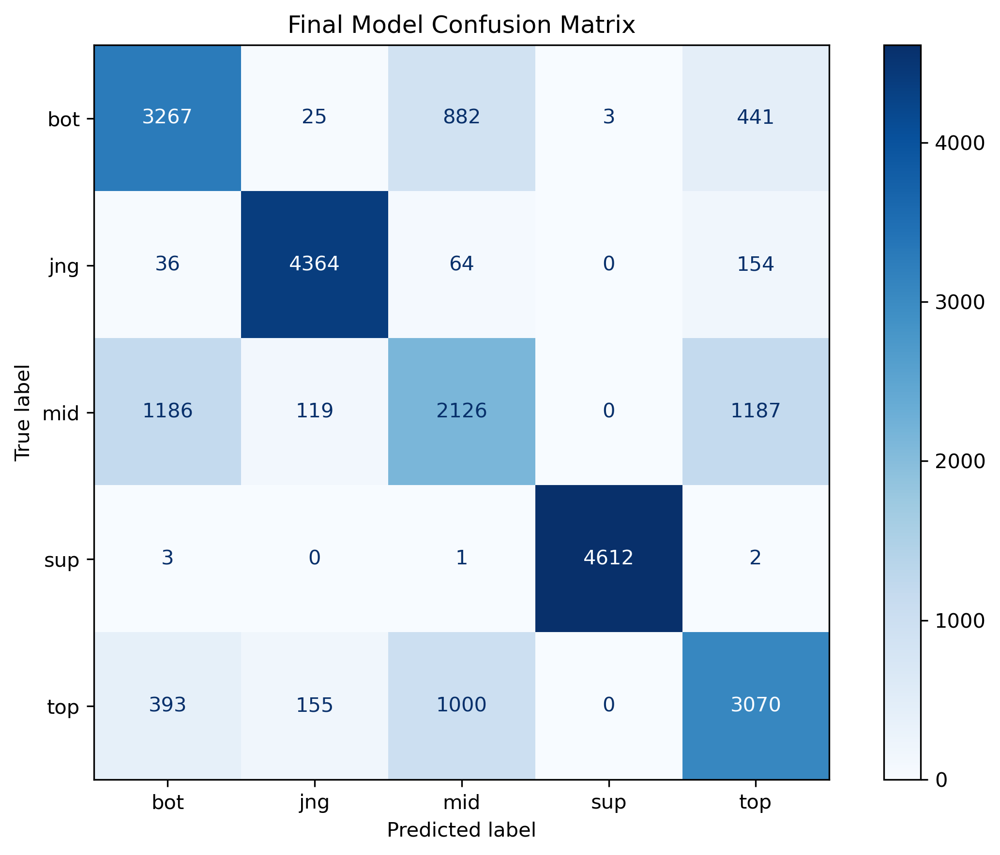
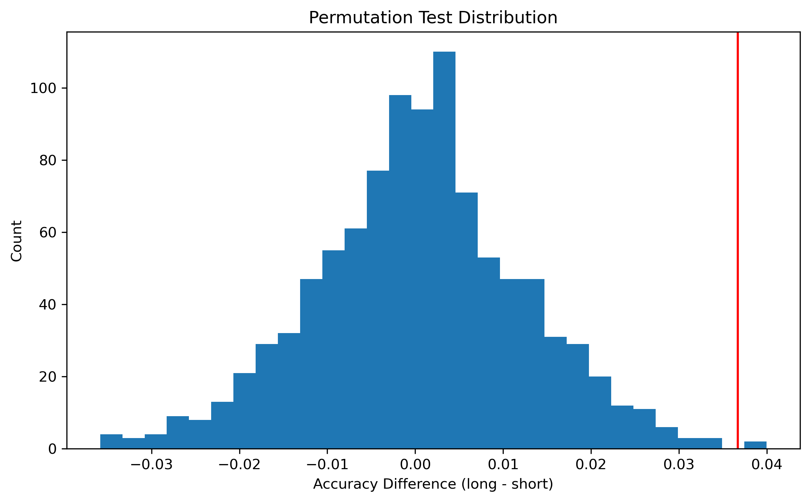

# **League of Legends - Game Analysis and Role Prediction**

**By: Victor Picorelli**  
**DSC 80** Final Project  
University of California, San Diego 

---

## Sections
- [Overview](#overview)
- [Introduction](#introduction)
- [Data Cleaning and Exploratory Data Analysis](#data-cleaning-and-exploratory-data-analysis)
- [Assessment of Missingness](#assessment-of-missingness)
- [Hypothesis Testing](#hypothesis-testing)
- [Framing a Prediction Problem](#framing-a-prediction-problem)
- [Baseline Model](#baseline-model)
- [Final Model](#final-model)
- [Fairness Analysis](#fairness-analysis)

---

## Overview

- This project explores professional League of Legends match data to better understand what actually drives a team's success.  
- We analyze how early-game advantage, macro decisions, and player performance impact win/loss outcomes.  
- Additionally, we build a model to predict a player's role based on in-game statistics.

---

## Introduction

### General Introduction

League of Legends(LOL) is a competitive multiplayer online battle arena (MOBA) game developed by Riot Games, where two teams of five players compete to destroy the enemy base. Each player takes on a specific role within the team, and success depends on a combination of strategy, coordination, and individual performance.

Games are typically divided into different phases:

- **Early Game**: The first minutes of the match, where players focus on gaining small advantages such as gold, experience, and lane pressure.  
- **Mid/Late Game**: Phases where team coordination becomes more important, especially around objectives like dragons, towers, and barons.  

Here are some key-concepts we are going to be utilizing:

- **Macro Game**: Refers to team-level decisions, such as objective control, map movements, and overall strategy.  
- **Micro Game**: Refers to individual player performance, including mechanics, positioning, and combat decisions.  

A common discussion in competitive and casual play is understanding what truly determines the outcome of a match. Is it early-game advantage? Strong macro decisions? Or individual player skill (Micro Game)?

This project is motivated by that question:

  "Which factors most strongly impact the win or loss of a team: early-game advantage, macro objective control, or player performance (micro)?"

Beyond analyzing these factors, we also approach a predictive task: identifying a player's role based on their in-game statistics.

In League of Legends, each team has five roles:

- **Top**: Usually plays more independently and is characterized by higher durability and more isolated performance. Players in this role tend to have moderate gold and damage, with less early interaction compared to other roles.
- **Jungle (Jng)**: Moves across the map and is characterized by high activity and objective involvement. Jungle players often have more assists, less consistent farming, and strong participation in map control.
- **Mid**: Central role with high impact on the game, typically showing high damage output and strong resource generation. Mid players are frequently involved in fights and contribute to overall map pressure.
- **Bot (ADC)**: Main damage dealer, especially in later stages of the game. This role is characterized by high gold income, high CS (farming), and strong sustained damage in team fights.
- **Support (Sup)**: Focused on enabling the team rather than dealing damage. Supports usually have low gold and damage, but high vision-related metrics and assist counts, playing a key role in team coordination.

Each role has distinct patterns in terms of gold, damage, vision, and map interaction. Because of that, we expect it to be possible to predict a player’s role using statistical in-game features alone.

---

### The Dataset

The dataset used in this project contains professional League of Legends match data collected from Oracle's Elixir. Each row represents a player’s performance in a specific match. It has 165 columns and 120.636 rows

The dataset includes information about:
- Match metadata (league, patch, date)
- Player role and team
- Champion selection and bans
- Combat statistics (kills, deaths, assists)
- Objective control (dragons, barons, towers)
- Gold, experience, and farming metrics
- Early-game performance at different timestamps (10, 15, 20, 25 minutes)

Below are some of the most relevant columns used in this analysis:

| Column | Description | Category |
|------|------------|----------|
| `position` | Player role (top, jng, mid, bot, sup) | Target / Role |
| `result` | Win (1) or Loss (0) | Outcome |
| `kills`, `deaths`, `assists` | Basic combat stats | Micro |
| `doublekills`, `triplekills`, `quadrakills`, `pentakills` | Multi-kill performance indicators | Micro |
| `damagetochampions`, `dpm` | Damage output during the game | Micro |
| `visionscore`, `wardsplaced` | Vision control and map awareness | Macro |
| `dragons`, `barons`, `towers` | Objectives secured by the team | Macro |
| `firstdragon`, `firstherald`, `firstbaron`, `firsttower` | First objective taken in the game | Early Game / Macro |
| `firstbloodkill`, `firstbloodassist`, `firstbloodvictim` | First kill involvement in the match | Early Game / Micro |
| `goldat10`, `golddiffat10` | Early gold and advantage at 10 minutes | Early Game |
| `xpat10`, `csat10` | Early experience and farming at 10 minutes| Early Game |
| `totalgold`, `earnedgold` | Overall economic performance | Macro / Micro |

These features allow us to break the game into three main components: early game, macro decisions, and individual player performance.

- **Early Game Indicators**  
  Early-game performance is captured through variables related to first objectives and early advantages. Metrics such as `firstdragon`, `firstherald`, `firsttower`, and early gold, experience, and CS differences (e.g., `golddiffat15`, `xpdiffat15`, `csdiffat15`) help measure how strong a team is in the first stages of the match.

- **Macro Indicators**  
  Macro play is reflected in how teams control the map and secure objectives. Variables such as `dragons`, `heralds`, `barons`, `towers`, and `inhibitors` represent objective control, while features like `side` and `firstPick` capture structural game advantages. Vision-related metrics like `wardsplaced` and `visionscore` also play an important role in understanding map control.

- **Micro Indicators**  
  Individual player performance is captured through combat and efficiency metrics. This includes basic stats like `kills`, `deaths`, and `assists`, as well as more advanced indicators such as damage output (`damagetochampions`, `dpm`), gold and resource efficiency(`totalgold`,`earnedgold`), and teamfight impact through multi-kills (`doublekill`, `triplekill`, `quadrakill`, and `pentakills`). Vision and map interaction at the player level also contribute to understanding individual impact.

By organizing the data in this way, we are able to connect in-game behavior with measurable statistics, making it possible to both analyze what drives match outcomes and build predictive models based on player performance.

By combining these different types of features, we are able to both:
1. Analyze what contributes most to winning games  
2. Build a predictive model that identifies player roles based on behavior and performance patterns  

### Sample of the Original Dataset

To provide an overview of the structure of the dataset before any preprocessing, we display a random sample of observations below.

| gameid             | datacompleteness   | url                                          | league   |   year | split              |   playoffs | date                |   game |   patch |   participantid | side   | position   | playername   | playerid                                  | teamname        | teamid                                  |   firstPick | champion   | ban1    | ban2    | ban3     | ban4         | ban5   | pick1   | pick2   | pick3    | pick4   | pick5      |   gamelength |   result |   kills |   deaths |   assists |   teamkills |   teamdeaths |   doublekills |   triplekills |   quadrakills |   pentakills |   firstblood |   firstbloodkill |   firstbloodassist |   firstbloodvictim |   team kpm |   ckpm |   firstdragon |   dragons |   opp_dragons |   elementaldrakes |   opp_elementaldrakes |   infernals |   mountains |   clouds |   oceans |   chemtechs |   hextechs |   dragons (type unknown) |   elders |   opp_elders |   firstherald |   heralds |   opp_heralds |   void_grubs |   opp_void_grubs |   firstbaron |   barons |   opp_barons |   atakhans |   opp_atakhans |   firsttower |   towers |   opp_towers |   firstmidtower |   firsttothreetowers |   turretplates |   opp_turretplates |   inhibitors |   opp_inhibitors |   damagetochampions |     dpm |   damageshare |   damagetakenperminute |   damagemitigatedperminute |   damagetotowers |   wardsplaced |   wpm |   wardskilled |   wcpm |   controlwardsbought |   visionscore |   vspm |   totalgold |   earnedgold |   earned gpm |   earnedgoldshare |   goldspent |   gspd |   gpr |   total cs |   minionkills |   monsterkills |   monsterkillsownjungle |   monsterkillsenemyjungle |   cspm |   goldat10 |   xpat10 |   csat10 |   opp_goldat10 |   opp_xpat10 |   opp_csat10 |   golddiffat10 |   xpdiffat10 |   csdiffat10 |   killsat10 |   assistsat10 |   deathsat10 |   opp_killsat10 |   opp_assistsat10 |   opp_deathsat10 |   goldat15 |   xpat15 |   csat15 |   opp_goldat15 |   opp_xpat15 |   opp_csat15 |   golddiffat15 |   xpdiffat15 |   csdiffat15 |   killsat15 |   assistsat15 |   deathsat15 |   opp_killsat15 |   opp_assistsat15 |   opp_deathsat15 |   goldat20 |   xpat20 |   csat20 |   opp_goldat20 |   opp_xpat20 |   opp_csat20 |   golddiffat20 |   xpdiffat20 |   csdiffat20 |   killsat20 |   assistsat20 |   deathsat20 |   opp_killsat20 |   opp_assistsat20 |   opp_deathsat20 |   goldat25 |   xpat25 |   csat25 |   opp_goldat25 |   opp_xpat25 |   opp_csat25 |   golddiffat25 |   xpdiffat25 |   csdiffat25 |   killsat25 |   assistsat25 |   deathsat25 |   opp_killsat25 |   opp_assistsat25 |   opp_deathsat25 |
|:-------------------|:-------------------|:---------------------------------------------|:---------|-------:|:-------------------|-----------:|:--------------------|-------:|--------:|----------------:|:-------|:-----------|:-------------|:------------------------------------------|:----------------|:----------------------------------------|------------:|:-----------|:--------|:--------|:---------|:-------------|:-------|:--------|:--------|:---------|:--------|:-----------|-------------:|---------:|--------:|---------:|----------:|------------:|-------------:|--------------:|--------------:|--------------:|-------------:|-------------:|-----------------:|-------------------:|-------------------:|-----------:|-------:|--------------:|----------:|--------------:|------------------:|----------------------:|------------:|------------:|---------:|---------:|------------:|-----------:|-------------------------:|---------:|-------------:|--------------:|----------:|--------------:|-------------:|-----------------:|-------------:|---------:|-------------:|-----------:|---------------:|-------------:|---------:|-------------:|----------------:|---------------------:|---------------:|-------------------:|-------------:|-----------------:|--------------------:|--------:|--------------:|-----------------------:|---------------------------:|-----------------:|--------------:|------:|--------------:|-------:|---------------------:|--------------:|-------:|------------:|-------------:|-------------:|------------------:|------------:|-------:|------:|-----------:|--------------:|---------------:|------------------------:|--------------------------:|-------:|-----------:|---------:|---------:|---------------:|-------------:|-------------:|---------------:|-------------:|-------------:|------------:|--------------:|-------------:|----------------:|------------------:|-----------------:|-----------:|---------:|---------:|---------------:|-------------:|-------------:|---------------:|-------------:|-------------:|------------:|--------------:|-------------:|----------------:|------------------:|-----------------:|-----------:|---------:|---------:|---------------:|-------------:|-------------:|---------------:|-------------:|-------------:|------------:|--------------:|-------------:|----------------:|------------------:|-----------------:|-----------:|---------:|---------:|---------------:|-------------:|-------------:|---------------:|-------------:|-------------:|------------:|--------------:|-------------:|----------------:|------------------:|-----------------:|
| LOLTMNT01_196798   | complete           | nan                                          | LJL      |   2025 | Forge              |          0 | 2025-01-31 11:07:01 |      1 |   15.02 |               2 | Blue   | jng        | Tatsu        | oe:player:c46dc30e7888a9b9eaee54bb9698d27 | We Can Win      | nan                                     |           1 | Xin Zhao   | K'Sante | Sejuani | Nocturne | Braum        | Sylas  | nan     | nan     | nan      | nan     | nan        |         2182 |        1 |       5 |        3 |        13 |          22 |           15 |             2 |             0 |             0 |            0 |            0 |                0 |                  0 |                  1 |       0.6  |   1.02 |           nan |       nan |           nan |               nan |                   nan |         nan |         nan |      nan |      nan |         nan |        nan |                      nan |      nan |          nan |           nan |       nan |           nan |          nan |              nan |          nan |        1 |            1 |        nan |            nan |          nan |      nan |          nan |             nan |                  nan |            nan |                nan |            1 |                0 |               25892 |  711.97 |          0.2  |                1738.35 |                    1186.91 |             1360 |             7 |  0.19 |             8 |   0.22 |                    5 |            45 |   1.24 |       14494 |         9767 |       268.57 |              0.22 |       11525 | nan    |   nan |        244 |            41 |            203 |                     nan |                       nan |   6.71 |       3259 |     3910 |       77 |           3097 |         3487 |           68 |            162 |          423 |            9 |           0 |             0 |            0 |               0 |                 0 |                0 |       5313 |     6088 |      105 |           5283 |         5613 |          105 |             30 |          475 |            0 |           2 |             0 |            1 |               1 |                 3 |                1 |       7115 |     8777 |      141 |           7133 |         7756 |          135 |            -18 |         1021 |            6 |           2 |             1 |            2 |               1 |                 5 |                2 |       9132 |    11515 |      169 |           8604 |         9953 |          168 |            528 |         1562 |            1 |           4 |             3 |            2 |               1 |                 6 |                3 |
| LOLTMNT02_239612   | complete           | nan                                          | LRS      |   2025 | Split 1            |          0 | 2025-03-30 19:28:09 |      1 |   15.06 |               4 | Blue   | bot        | Horus        | oe:player:0d972c4c17b8777458c98282a40c1ad | Malvinas Gaming | oe:team:d5772fdb1ae7fcc8046fa2e056a8715 |           1 | Kai'Sa     | Ezreal  | Rumble  | Jayce    | Renata Glasc | Poppy  | nan     | nan     | nan      | nan     | nan        |         2105 |        1 |       7 |        2 |        11 |          24 |           13 |             1 |             1 |             0 |            0 |            1 |                0 |                  1 |                  0 |       0.68 |   1.05 |           nan |       nan |           nan |               nan |                   nan |         nan |         nan |      nan |      nan |         nan |        nan |                      nan |      nan |          nan |           nan |       nan |           nan |          nan |              nan |          nan |        0 |            0 |        nan |            nan |          nan |      nan |          nan |             nan |                  nan |            nan |                nan |            0 |                0 |               28770 |  820.05 |          0.26 |                 425.44 |                     322.4  |             4444 |            14 |  0.4  |             6 |   0.17 |                    1 |            31 |   0.88 |       14650 |        10080 |       287.32 |              0.23 |       12575 | nan    |   nan |        277 |           271 |              6 |                     nan |                       nan |   7.9  |       3003 |     3532 |       63 |           3058 |         3699 |           73 |            -55 |         -167 |          -10 |           0 |             3 |            0 |               0 |                 1 |                0 |       4857 |     6146 |      109 |           4886 |         6051 |          127 |            -29 |           95 |          -18 |           1 |             3 |            0 |               0 |                 1 |                0 |       6849 |     8983 |      155 |           6658 |         8578 |          170 |            191 |          405 |          -15 |           1 |             7 |            0 |               0 |                 1 |                1 |       8917 |    12544 |      204 |           8672 |        11067 |          220 |            245 |         1477 |          -16 |           1 |            10 |            1 |               0 |                 5 |                2 |
| LOLTMNT05_109372   | complete           | nan                                          | NLC      |   2025 | Winter             |          1 | 2025-02-12 19:32:02 |      3 |   15.03 |              10 | Red    | sup        | Eski         | oe:player:e38b7e92f32edc7bd206592ee7963ca | Rich Gang       | oe:team:2b20d0fcdb72f7b490eb1dc468136cf |           0 | Lulu       | Skarner | K'Sante | Poppy    | Braum        | Pyke   | nan     | nan     | nan      | nan     | nan        |         2162 |        1 |       1 |        1 |        12 |          22 |           13 |             0 |             0 |             0 |            0 |            1 |                0 |                  1 |                  0 |       0.61 |   0.97 |           nan |       nan |           nan |               nan |                   nan |         nan |         nan |      nan |      nan |         nan |        nan |                      nan |      nan |          nan |           nan |       nan |           nan |          nan |              nan |          nan |        0 |            0 |        nan |            nan |          nan |      nan |          nan |             nan |                  nan |            nan |                nan |            0 |                0 |                6423 |  178.25 |          0.06 |                 264.2  |                     147.28 |              635 |            47 |  1.3  |             8 |   0.22 |                    9 |            89 |   2.47 |        9195 |         4509 |       125.13 |              0.09 |        7575 | nan    |   nan |         40 |            40 |              0 |                     nan |                       nan |   1.11 |       2256 |     3147 |       19 |           2291 |         2896 |           11 |            -35 |          251 |            8 |           0 |             1 |            0 |               0 |                 2 |                0 |       3341 |     4528 |       29 |           3453 |         4806 |           19 |           -112 |         -278 |           10 |           0 |             1 |            0 |               0 |                 3 |                0 |       4428 |     6123 |       31 |           4365 |         6621 |           22 |             63 |         -498 |            9 |           0 |             3 |            1 |               0 |                 3 |                1 |       5772 |     7956 |       33 |           5282 |         8134 |           23 |            490 |         -178 |           10 |           1 |             6 |            1 |               0 |                 4 |                2 |
| 11921-11921_game_3 | partial            | https://lpl.qq.com/es/stats.shtml?bmid=11921 | LPL      |   2025 | Split 2 Placements |          0 | 2025-03-31 12:56:51 |      3 |   15.06 |               7 | Red    | jng        | Monki        | oe:player:a23b45071ea855f85e43db4b5a1683d | Team WE         | oe:team:62c1cd9465dc63824593ee5046f5aa8 |           0 | Olaf       | Naafiri | Yone    | Akali    | Gnar         | Jax    | nan     | nan     | nan      | nan     | nan        |         1929 |        1 |       1 |        3 |        12 |          18 |           13 |           nan |           nan |           nan |          nan |          nan |                0 |                nan |                nan |       0.56 |   0.96 |           nan |       nan |           nan |               nan |                   nan |         nan |         nan |      nan |      nan |         nan |        nan |                      nan |      nan |          nan |           nan |       nan |           nan |          nan |              nan |          nan |      nan |          nan |        nan |            nan |          nan |      nan |          nan |             nan |                  nan |            nan |                nan |          nan |              nan |               17391 |  540.93 |          0.21 |                1215.83 |                     nan    |              nan |             8 |  0.25 |             5 |   0.16 |                    6 |            38 |   1.18 |       12981 |         8770 |       272.78 |              0.2  |       11475 | nan    |   nan |        271 |            50 |            221 |                     151 |                        20 |   8.43 |        nan |      nan |      nan |            nan |          nan |          nan |            nan |          nan |          nan |         nan |           nan |          nan |             nan |               nan |              nan |        nan |      nan |      nan |            nan |          nan |          nan |            nan |          nan |          nan |         nan |           nan |          nan |             nan |               nan |              nan |        nan |      nan |      nan |            nan |          nan |          nan |            nan |          nan |          nan |         nan |           nan |          nan |             nan |               nan |              nan |        nan |      nan |      nan |            nan |          nan |          nan |            nan |          nan |          nan |         nan |           nan |          nan |             nan |               nan |              nan |
| 12439-12439_game_4 | partial            | https://lpl.qq.com/es/stats.shtml?bmid=12439 | LPL      |   2025 | Split 2            |          1 | 2025-06-13 12:08:10 |      4 |   15.11 |             200 | Red    | team       | nan          | nan                                       | Bilibili Gaming | oe:team:d356a144644879dabb5f34cd99c886d |           0 | nan        | Taliyah | Trundle | Orianna  | Miss Fortune | Akali  | Jayce   | Varus   | Xin Zhao | Karma   | Cassiopeia |         1708 |        1 |      29 |       10 |        75 |          29 |           10 |           nan |           nan |           nan |          nan |            1 |              nan |                nan |                nan |       1.02 |   1.37 |             1 |         4 |             0 |               nan |                   nan |         nan |         nan |      nan |      nan |         nan |        nan |                        4 |      nan |          nan |           nan |         1 |             0 |            0 |                3 |          nan |        1 |            0 |        nan |            nan |            1 |        9 |            2 |             nan |                  nan |            nan |                nan |            2 |                0 |              101177 | 3554.23 |        nan    |                4258.52 |                     nan    |              nan |           118 |  4.15 |            40 |   1.41 |                   47 |           259 |   9.1  |       60294 |        41494 |      1457.63 |            nan    |       51493 |   0.11 |   nan |        nan |           nan |            211 |                     135 |                        20 | nan    |        nan |      nan |      nan |            nan |          nan |          nan |            nan |          nan |          nan |         nan |           nan |          nan |             nan |               nan |              nan |        nan |      nan |      nan |            nan |          nan |          nan |            nan |          nan |          nan |         nan |           nan |          nan |             nan |               nan |              nan |        nan |      nan |      nan |            nan |          nan |          nan |            nan |          nan |          nan |         nan |           nan |          nan |             nan |               nan |              nan |        nan |      nan |      nan |            nan |          nan |          nan |            nan |          nan |          nan |         nan |           nan |          nan |             nan |               nan |              nan |

---
## Data Cleaning and Exploratory Data Analysis

### Data Cleaning

To prepare the data for both the analytical and predictive parts of this project, we divided the cleaning process into four main steps: removing incomplete observations, separating team and player rows, converting game length into minutes, and creating new columns.

#### 1. Removing Incomplete Data

One of the first checks in the dataset was the `datacompleteness` column, which indicates whether a row contains complete match information or only partial information.

Because this project relies on detailed match statistics, rows labeled as incomplete or partial could not be used reliably. For that reason, we removed all rows that were not marked as `complete`. This step removed approximately 10,000 rows from the original dataset.

To illustrate this difference, the table below shows one example of a complete row and one example of a non-complete row from the original dataset.

| gameid             | datacompleteness   | url                                          | league   |   year | split   |   playoffs | date                |   game |   patch |   participantid | side   | position   | playername   | playerid                                  | teamname     | teamid                                  |   firstPick | champion   | ban1   | ban2    | ban3   | ban4    | ban5   |   pick1 |   pick2 |   pick3 |   pick4 |   pick5 |   gamelength |   result |   kills |   deaths |   assists |   teamkills |   teamdeaths |   doublekills |   triplekills |   quadrakills |   pentakills |   firstblood |   firstbloodkill |   firstbloodassist |   firstbloodvictim |   team kpm |   ckpm |   firstdragon |   dragons |   opp_dragons |   elementaldrakes |   opp_elementaldrakes |   infernals |   mountains |   clouds |   oceans |   chemtechs |   hextechs |   dragons (type unknown) |   elders |   opp_elders |   firstherald |   heralds |   opp_heralds |   void_grubs |   opp_void_grubs |   firstbaron |   barons |   opp_barons |   atakhans |   opp_atakhans |   firsttower |   towers |   opp_towers |   firstmidtower |   firsttothreetowers |   turretplates |   opp_turretplates |   inhibitors |   opp_inhibitors |   damagetochampions |     dpm |   damageshare |   damagetakenperminute |   damagemitigatedperminute |   damagetotowers |   wardsplaced |    wpm |   wardskilled |   wcpm |   controlwardsbought |   visionscore |   vspm |   totalgold |   earnedgold |   earned gpm |   earnedgoldshare |   goldspent |   gspd |   gpr |   total cs |   minionkills |   monsterkills |   monsterkillsownjungle |   monsterkillsenemyjungle |   cspm |   goldat10 |   xpat10 |   csat10 |   opp_goldat10 |   opp_xpat10 |   opp_csat10 |   golddiffat10 |   xpdiffat10 |   csdiffat10 |   killsat10 |   assistsat10 |   deathsat10 |   opp_killsat10 |   opp_assistsat10 |   opp_deathsat10 |   goldat15 |   xpat15 |   csat15 |   opp_goldat15 |   opp_xpat15 |   opp_csat15 |   golddiffat15 |   xpdiffat15 |   csdiffat15 |   killsat15 |   assistsat15 |   deathsat15 |   opp_killsat15 |   opp_assistsat15 |   opp_deathsat15 |   goldat20 |   xpat20 |   csat20 |   opp_goldat20 |   opp_xpat20 |   opp_csat20 |   golddiffat20 |   xpdiffat20 |   csdiffat20 |   killsat20 |   assistsat20 |   deathsat20 |   opp_killsat20 |   opp_assistsat20 |   opp_deathsat20 |   goldat25 |   xpat25 |   csat25 |   opp_goldat25 |   opp_xpat25 |   opp_csat25 |   golddiffat25 |   xpdiffat25 |   csdiffat25 |   killsat25 |   assistsat25 |   deathsat25 |   opp_killsat25 |   opp_assistsat25 |   opp_deathsat25 |
|:-------------------|:-------------------|:---------------------------------------------|:---------|-------:|:--------|-----------:|:--------------------|-------:|--------:|----------------:|:-------|:-----------|:-------------|:------------------------------------------|:-------------|:----------------------------------------|------------:|:-----------|:-------|:--------|:-------|:--------|:-------|--------:|--------:|--------:|--------:|--------:|-------------:|---------:|--------:|---------:|----------:|------------:|-------------:|--------------:|--------------:|--------------:|-------------:|-------------:|-----------------:|-------------------:|-------------------:|-----------:|-------:|--------------:|----------:|--------------:|------------------:|----------------------:|------------:|------------:|---------:|---------:|------------:|-----------:|-------------------------:|---------:|-------------:|--------------:|----------:|--------------:|-------------:|-----------------:|-------------:|---------:|-------------:|-----------:|---------------:|-------------:|---------:|-------------:|----------------:|---------------------:|---------------:|-------------------:|-------------:|-----------------:|--------------------:|--------:|--------------:|-----------------------:|---------------------------:|-----------------:|--------------:|-------:|--------------:|-------:|---------------------:|--------------:|-------:|------------:|-------------:|-------------:|------------------:|------------:|-------:|------:|-----------:|--------------:|---------------:|------------------------:|--------------------------:|-------:|-----------:|---------:|---------:|---------------:|-------------:|-------------:|---------------:|-------------:|-------------:|------------:|--------------:|-------------:|----------------:|------------------:|-----------------:|-----------:|---------:|---------:|---------------:|-------------:|-------------:|---------------:|-------------:|-------------:|------------:|--------------:|-------------:|----------------:|------------------:|-----------------:|-----------:|---------:|---------:|---------------:|-------------:|-------------:|---------------:|-------------:|-------------:|------------:|--------------:|-------------:|----------------:|------------------:|-----------------:|-----------:|---------:|---------:|---------------:|-------------:|-------------:|---------------:|-------------:|-------------:|------------:|--------------:|-------------:|----------------:|------------------:|-----------------:|
| LOLTMNT03_179647   | complete           | nan                                          | LFL2     |   2025 | Winter  |          0 | 2025-01-11 11:11:24 |      1 |   15.01 |               1 | Blue   | top        | PatkicaA     | oe:player:c659697694306de62d978569b84c344 | IziDream     | oe:team:84bc703e28859788770611d94cf02ac |           1 | Gnar       | Vi     | Skarner | Corki  | K'Sante | Sylas  |     nan |     nan |     nan |     nan |     nan |         1592 |        0 |       1 |        2 |         1 |           3 |           13 |             0 |             0 |             0 |            0 |            0 |                0 |                  0 |                  1 |     0.1131 | 0.603  |           nan |       nan |           nan |               nan |                   nan |         nan |         nan |      nan |      nan |         nan |        nan |                      nan |      nan |          nan |           nan |       nan |           nan |          nan |              nan |          nan |        0 |            0 |        nan |            nan |          nan |      nan |          nan |             nan |                  nan |            nan |                nan |            0 |                1 |               20156 | 759.648 |      0.40197  |                681.219 |                    629.736 |             7451 |             9 | 0.3392 |             2 | 0.0754 |                    3 |            17 | 0.6407 |       10668 |         7145 |      269.284 |          0.289981 |        9793 |    nan |   nan |        234 |           234 |              0 |                     nan |                       nan | 8.8191 |       3058 |     4466 |       75 |           3394 |         4603 |           79 |           -336 |         -137 |           -4 |           0 |             0 |            1 |               1 |                 0 |                0 |       4531 |     6777 |      119 |           5372 |         6968 |          125 |           -841 |         -191 |           -6 |           0 |             0 |            1 |               1 |                 2 |                0 |       6473 |     9072 |      154 |           7012 |         9562 |          154 |           -539 |         -490 |            0 |           1 |             1 |            2 |               2 |                 2 |                2 |       9244 |    12552 |      217 |           9020 |        12553 |          200 |            224 |           -1 |           17 |           1 |             1 |            2 |               2 |                 4 |                2 |
| 11715-11715_game_1 | partial            | https://lpl.qq.com/es/stats.shtml?bmid=11715 | LPL      |   2025 | Split 1 |          0 | 2025-01-12 09:24:17 |      1 |   15.01 |               1 | Blue   | top        | Breathe      | oe:player:0d9b0a3b3a93a8f759c9d8ac8eef97c | Weibo Gaming | oe:team:606c6ac695907af3823ee6405c58ff1 |           1 | K'Sante    | Jayce  | Poppy   | Rumble | Rakan   | Rell   |     nan |     nan |     nan |     nan |     nan |         2123 |        1 |       4 |        0 |         3 |          17 |            5 |           nan |           nan |           nan |          nan |          nan |                0 |                nan |                nan |     0.4805 | 0.6218 |           nan |       nan |           nan |               nan |                   nan |         nan |         nan |      nan |      nan |         nan |        nan |                      nan |      nan |          nan |           nan |       nan |           nan |          nan |              nan |          nan |      nan |          nan |        nan |            nan |          nan |      nan |          nan |             nan |                  nan |            nan |                nan |          nan |              nan |                9830 | 277.814 |      0.123949 |                747.103 |                    nan     |              nan |            14 | 0.3957 |             3 | 0.0848 |                    5 |            32 | 0.9044 |       14706 |        10099 |      285.417 |          0.217523 |       12934 |    nan |   nan |        314 |           310 |              4 |                       0 |                         0 | 8.8742 |        nan |      nan |      nan |            nan |          nan |          nan |            nan |          nan |          nan |         nan |           nan |          nan |             nan |               nan |              nan |        nan |      nan |      nan |            nan |          nan |          nan |            nan |          nan |          nan |         nan |           nan |          nan |             nan |               nan |              nan |        nan |      nan |      nan |            nan |          nan |          nan |            nan |          nan |          nan |         nan |           nan |          nan |             nan |               nan |              nan |        nan |      nan |      nan |            nan |          nan |          nan |            nan |          nan |          nan |         nan |           nan |          nan |             nan |               nan |              nan |

#### 2. Separating Team-Level and Player-Level Data

The original dataset contains both player and team information in the same table. Each match contributes 12 rows in total: 10 rows for players (5 per team) and 2 rows for teams (1 per team).

Because of this structure, several columns are only meaningful for players, while others are only meaningful for teams. As a result, many values appear as missing depending on the type of row. For example, team rows may contain `NaN` in player-specific statistics, while player rows may contain `NaN` in team-level objective metrics.

To make the analysis more consistent, we split the data into two separate DataFrames:

- `df_players`, containing only player-level rows
- `df_teams`, containing only team-level rows

After that, we removed columns that were not relevant for each specific dataset. This helped reduce unnecessary missing values and made each table more focused on the type of analysis it would support.

#### 3. Converting Game Length into Minutes

The `gamelength` column was originally stored in seconds. Since minutes are much easier to interpret in the context of League of Legends matches, we converted this variable from seconds to minutes in both the player-level and team-level datasets.

This small transformation makes the data more readable and improves the interpretation of later visualizations and analyses.

#### 4. Creating New Columns

Finally, we created two additional variables to better summarize important parts of the game.

For the team-level dataset, we created `first_objective_count`, which counts how many key first objectives a team secured among:
- first baron
- first herald
- first dragon
- first tower

This feature provides a simple way to summarize early objective control.

For the player-level dataset, we created `dmg_eff`, which measures damage efficiency by dividing total damage to champions by total gold. This gives a rough sense of how efficiently a player converted resources into combat impact.

Together, these new variables make the dataset more informative for both the match outcome analysis and the role prediction task.

#### Sample of the Cleaned Player-Level Dataset

The table below shows a sample of the cleaned `df_players` dataset.

| gameid           | league   |   playoffs |   game |   participantid | side   | position   | playername   | playerid                                  | teamname                  | teamid                                  |   firstPick | champion   | ban1     | ban2   | ban3     | ban4     | ban5     |   gamelength |   result |   kills |   deaths |   assists |   teamkills |   teamdeaths |   doublekills |   triplekills |   quadrakills |   pentakills |   firstbloodkill |   firstbloodassist |   firstbloodvictim |   team kpm |   ckpm |   barons |   opp_barons |   inhibitors |   opp_inhibitors |   damagetochampions |     dpm |   damageshare |   damagetakenperminute |   damagemitigatedperminute |   damagetotowers |   wardsplaced |    wpm |   wardskilled |   wcpm |   controlwardsbought |   visionscore |   vspm |   totalgold |   earnedgold |   earned gpm |   earnedgoldshare |   goldspent |   total cs |   minionkills |   monsterkills |   cspm |   goldat10 |   xpat10 |   csat10 |   opp_goldat10 |   opp_xpat10 |   opp_csat10 |   golddiffat10 |   xpdiffat10 |   csdiffat10 |   killsat10 |   assistsat10 |   deathsat10 |   opp_killsat10 |   opp_assistsat10 |   opp_deathsat10 |   goldat15 |   xpat15 |   csat15 |   opp_goldat15 |   opp_xpat15 |   opp_csat15 |   golddiffat15 |   xpdiffat15 |   csdiffat15 |   killsat15 |   assistsat15 |   deathsat15 |   opp_killsat15 |   opp_assistsat15 |   opp_deathsat15 |   goldat20 |   xpat20 |   csat20 |   opp_goldat20 |   opp_xpat20 |   opp_csat20 |   golddiffat20 |   xpdiffat20 |   csdiffat20 |   killsat20 |   assistsat20 |   deathsat20 |   opp_killsat20 |   opp_assistsat20 |   opp_deathsat20 |   goldat25 |   xpat25 |   csat25 |   opp_goldat25 |   opp_xpat25 |   opp_csat25 |   golddiffat25 |   xpdiffat25 |   csdiffat25 |   killsat25 |   assistsat25 |   deathsat25 |   opp_killsat25 |   opp_assistsat25 |   opp_deathsat25 |   dmg_eff |
|:-----------------|:---------|-----------:|-------:|----------------:|:-------|:-----------|:-------------|:------------------------------------------|:--------------------------|:----------------------------------------|------------:|:-----------|:---------|:-------|:---------|:---------|:---------|-------------:|---------:|--------:|---------:|----------:|------------:|-------------:|--------------:|--------------:|--------------:|-------------:|-----------------:|-------------------:|-------------------:|-----------:|-------:|---------:|-------------:|-------------:|-----------------:|--------------------:|--------:|--------------:|-----------------------:|---------------------------:|-----------------:|--------------:|-------:|--------------:|-------:|---------------------:|--------------:|-------:|------------:|-------------:|-------------:|------------------:|------------:|-----------:|--------------:|---------------:|-------:|-----------:|---------:|---------:|---------------:|-------------:|-------------:|---------------:|-------------:|-------------:|------------:|--------------:|-------------:|----------------:|------------------:|-----------------:|-----------:|---------:|---------:|---------------:|-------------:|-------------:|---------------:|-------------:|-------------:|------------:|--------------:|-------------:|----------------:|------------------:|-----------------:|-----------:|---------:|---------:|---------------:|-------------:|-------------:|---------------:|-------------:|-------------:|------------:|--------------:|-------------:|----------------:|------------------:|-----------------:|-----------:|---------:|---------:|---------------:|-------------:|-------------:|---------------:|-------------:|-------------:|------------:|--------------:|-------------:|----------------:|------------------:|-----------------:|----------:|
| LOLTMNT06_123088 | AL       |          0 |      5 |               8 | Red    | mid        | Deceiving    | oe:player:a1f7f2fe1ac52d8e96df181b0a94b6b | FN Esports                | oe:team:402e5fe9cbc5ebb9548e90fa7ffbf87 |           0 | Syndra     | Xin Zhao | Ezreal | Rumble   | Yorick   | Renekton |      26.75   |        1 |       4 |        2 |         9 |          25 |           11 |             0 |             0 |             0 |            0 |                0 |                  1 |                  0 |     0.9346 | 1.3458 |        0 |            0 |            1 |                0 |               15374 | 574.729 |      0.174304 |                461.047 |                    260.486 |             6303 |            12 | 0.4486 |             4 | 0.1495 |                    3 |            21 | 0.785  |       12406 |         8856 |      331.065 |          0.227059 |       11375 |        251 |           243 |              8 | 9.3832 |       3524 |     4356 |       82 |           3643 |         4868 |           87 |           -119 |         -512 |           -5 |           0 |             3 |            1 |               0 |                 2 |                1 |       5297 |     7116 |      135 |           5520 |         8153 |          139 |           -223 |        -1037 |           -4 |           0 |             3 |            2 |               0 |                 4 |                1 |       7785 |    10123 |      181 |           7291 |        10163 |          176 |            494 |          -40 |            5 |           1 |             5 |            2 |               0 |                 6 |                2 |      11492 |    13896 |      240 |          10222 |        13119 |          213 |           1270 |          777 |           27 |           4 |             6 |            2 |               2 |                 6 |                3 |   1.23924 |
| LOLTMNT06_128710 | EWC      |          1 |      1 |               6 | Red    | top        | Flandre      | oe:player:aad3806ef26a116c73b11efa07e9bd8 | Anyone's Legend           | oe:team:ed28f87f0cfdba0a2a8f183cebae73a |           0 | Rumble     | Gwen     | Xayah  | Senna    | Poppy    | Ambessa  |      30.1167 |        0 |       0 |        1 |         0 |           5 |           11 |             0 |             0 |             0 |            0 |                0 |                  0 |                  0 |     0.166  | 0.5313 |        0 |            0 |            0 |                0 |                9664 | 320.885 |      0.179866 |                505.933 |                    557.665 |                0 |            19 | 0.6309 |             1 | 0.0332 |                   10 |            34 | 1.1289 |        9471 |         5509 |      182.922 |          0.191185 |        8950 |        222 |           222 |              0 | 7.3713 |       3097 |     4457 |       71 |           2881 |         4283 |           67 |            216 |          174 |            4 |           0 |             0 |            0 |               0 |                 0 |                0 |       4736 |     7159 |      118 |           4518 |         6839 |          115 |            218 |          320 |            3 |           0 |             0 |            0 |               0 |                 0 |                1 |       6233 |     9821 |      158 |           6316 |         9454 |          163 |            -83 |          367 |           -5 |           0 |             0 |            0 |               0 |                 0 |                1 |       7911 |    12889 |      198 |           7996 |        12136 |          204 |            -85 |          753 |           -6 |           0 |             0 |            0 |               0 |                 0 |                1 |   1.02038 |
| LOLTMNT03_261937 | MSI      |          0 |      1 |               6 | Red    | top        | BrokenBlade  | oe:player:84bff3a326833c7c9181c698f676878 | G2 Esports                | oe:team:7d6673d3a9d00363c6bebc1a630da6e |           0 | Aatrox     | Taliyah  | Rumble | Renekton | Rakan    | Braum    |      38.7167 |        0 |       2 |        2 |         1 |           7 |           14 |             0 |             0 |             0 |            0 |                0 |                  1 |                  0 |     0.1808 | 0.5424 |        0 |            0 |            0 |                1 |               23792 | 614.516 |      0.222853 |               1248.33  |                   1006.93  |             1423 |            14 | 0.3616 |             8 | 0.2066 |                    8 |            49 | 1.2656 |       13762 |         8747 |      225.923 |          0.226728 |       13825 |        290 |           287 |              3 | 7.4903 |       3200 |     4803 |       84 |           3450 |         4945 |           90 |           -250 |         -142 |           -6 |           0 |             0 |            0 |               0 |                 0 |                0 |       4922 |     7525 |      131 |           4998 |         7350 |          134 |            -76 |          175 |           -3 |           0 |             1 |            0 |               0 |                 0 |                1 |       6708 |     9853 |      175 |           6981 |        10350 |          166 |           -273 |         -497 |            9 |           0 |             1 |            1 |               1 |                 1 |                2 |       8086 |    11762 |      209 |           8651 |        12969 |          192 |           -565 |        -1207 |           17 |           0 |             1 |            1 |               1 |                 2 |                2 |   1.72882 |
| LOLTMNT01_281783 | LPLOL    |          0 |      2 |               1 | Blue   | top        | Ilyxøu       | oe:player:5364c86869641cd982e519f65c5797b | Leões Porto Salvo Esports | oe:team:0957b09f054bf983fcc61228d919bef |           1 | Renekton   | Nocturne | Sylas  | Aurora   | Ambessa  | Jax      |      35.05   |        0 |       4 |        6 |         7 |          15 |           25 |             0 |             0 |             0 |            0 |                0 |                  0 |                  0 |     0.428  | 1.1412 |        0 |            0 |            0 |                1 |               29628 | 845.307 |      0.261337 |               1181.46  |                   1194.84  |             2046 |             6 | 0.1712 |             4 | 0.1141 |                    2 |            23 | 0.6562 |       12390 |         7824 |      223.224 |          0.207489 |       12000 |        214 |           207 |              7 | 6.1056 |       2960 |     4471 |       54 |           4069 |         5254 |           78 |          -1109 |         -783 |          -24 |           1 |             0 |            2 |               3 |                 0 |                1 |       5141 |     7517 |       97 |           5717 |         7404 |          116 |           -576 |          113 |          -19 |           2 |             1 |            2 |               4 |                 0 |                3 |       7167 |     9715 |      145 |           7737 |        10532 |          172 |           -570 |         -817 |          -27 |           2 |             1 |            2 |               4 |                 0 |                3 |       9570 |    11896 |      172 |           9609 |        12775 |          200 |            -39 |         -879 |          -28 |           3 |             4 |            2 |               5 |                 2 |                4 |   2.39128 |
| LOLTMNT02_239326 | LJL      |          0 |      1 |               2 | Blue   | jng        | Norwegian    | oe:player:da550ca06bcacbd30b7c6ed32c864c7 | Yang Yang Gaming          | oe:team:4c8ce94c32c391c558644af9a3cd884 |           1 | Taliyah    | Zyra     | Varus  | Ambessa  | Nautilus | Galio    |      23.1333 |        1 |       6 |        2 |        12 |          21 |            5 |             0 |             0 |             0 |            0 |                0 |                  1 |                  0 |     0.9078 | 1.1239 |        0 |            0 |            0 |                0 |               17446 | 754.15  |      0.246757 |                722.291 |                    302.94  |             2937 |             6 | 0.2594 |             2 | 0.0865 |                    4 |            25 | 1.0807 |       11332 |         8225 |      355.548 |          0.263361 |       10400 |        170 |            38 |            132 | 7.3487 |       4265 |     3503 |       67 |           2950 |         3282 |           61 |           1315 |          221 |            6 |           2 |             4 |            0 |               0 |                 0 |                3 |       6624 |     6284 |      104 |           4968 |         5738 |          100 |           1656 |          546 |            4 |           4 |             5 |            0 |               1 |                 1 |                4 |       9298 |     9216 |      145 |           6729 |         8222 |          135 |           2569 |          994 |           10 |           5 |             6 |            1 |               1 |                 3 |                5 |        nan |      nan |      nan |            nan |          nan |          nan |            nan |          nan |          nan |         nan |           nan |          nan |             nan |               nan |              nan |   1.53953 |

#### Sample of the Cleaned Team-Level Dataset

The table below shows a sample of the cleaned `df_teams` dataset.

| gameid           | league   |   playoffs |   game |   participantid | side   | teamname                     | teamid                                  |   firstPick | ban1    | ban2     | ban3     | ban4    | ban5    | pick1   | pick2   | pick3   | pick4     | pick5   |   gamelength |   result |   teamkills |   teamdeaths |   doublekills |   triplekills |   quadrakills |   pentakills |   team kpm |   ckpm |   firstdragon |   dragons |   opp_dragons |   elementaldrakes |   opp_elementaldrakes |   infernals |   mountains |   clouds |   oceans |   chemtechs |   hextechs |   dragons (type unknown) |   elders |   opp_elders |   firstherald |   heralds |   opp_heralds |   void_grubs |   opp_void_grubs |   firstbaron |   barons |   opp_barons |   atakhans |   opp_atakhans |   firsttower |   towers |   opp_towers |   firstmidtower |   firsttothreetowers |   turretplates |   opp_turretplates |   inhibitors |   opp_inhibitors |   damagetochampions |     dpm |   damagetakenperminute |   damagemitigatedperminute |   damagetotowers |   wardsplaced |    wpm |   wardskilled |   wcpm |   controlwardsbought |   visionscore |   vspm |   totalgold |   earnedgold |   earned gpm |   goldspent |        gspd |   gpr |   minionkills |   monsterkills |    cspm |   goldat10 |   xpat10 |   csat10 |   opp_goldat10 |   opp_xpat10 |   opp_csat10 |   golddiffat10 |   xpdiffat10 |   csdiffat10 |   killsat10 |   assistsat10 |   deathsat10 |   opp_killsat10 |   opp_assistsat10 |   opp_deathsat10 |   goldat15 |   xpat15 |   csat15 |   opp_goldat15 |   opp_xpat15 |   opp_csat15 |   golddiffat15 |   xpdiffat15 |   csdiffat15 |   killsat15 |   assistsat15 |   deathsat15 |   opp_killsat15 |   opp_assistsat15 |   opp_deathsat15 |   goldat20 |   xpat20 |   csat20 |   opp_goldat20 |   opp_xpat20 |   opp_csat20 |   golddiffat20 |   xpdiffat20 |   csdiffat20 |   killsat20 |   assistsat20 |   deathsat20 |   opp_killsat20 |   opp_assistsat20 |   opp_deathsat20 |   goldat25 |   xpat25 |   csat25 |   opp_goldat25 |   opp_xpat25 |   opp_csat25 |   golddiffat25 |   xpdiffat25 |   csdiffat25 |   killsat25 |   assistsat25 |   deathsat25 |   opp_killsat25 |   opp_assistsat25 |   opp_deathsat25 |   first_objective_count |
|:-----------------|:---------|-----------:|-------:|----------------:|:-------|:-----------------------------|:----------------------------------------|------------:|:--------|:---------|:---------|:--------|:--------|:--------|:--------|:--------|:----------|:--------|-------------:|---------:|------------:|-------------:|--------------:|--------------:|--------------:|-------------:|-----------:|-------:|--------------:|----------:|--------------:|------------------:|----------------------:|------------:|------------:|---------:|---------:|------------:|-----------:|-------------------------:|---------:|-------------:|--------------:|----------:|--------------:|-------------:|-----------------:|-------------:|---------:|-------------:|-----------:|---------------:|-------------:|---------:|-------------:|----------------:|---------------------:|---------------:|-------------------:|-------------:|-----------------:|--------------------:|--------:|-----------------------:|---------------------------:|-----------------:|--------------:|-------:|--------------:|-------:|---------------------:|--------------:|-------:|------------:|-------------:|-------------:|------------:|------------:|------:|--------------:|---------------:|--------:|-----------:|---------:|---------:|---------------:|-------------:|-------------:|---------------:|-------------:|-------------:|------------:|--------------:|-------------:|----------------:|------------------:|-----------------:|-----------:|---------:|---------:|---------------:|-------------:|-------------:|---------------:|-------------:|-------------:|------------:|--------------:|-------------:|----------------:|------------------:|-----------------:|-----------:|---------:|---------:|---------------:|-------------:|-------------:|---------------:|-------------:|-------------:|------------:|--------------:|-------------:|----------------:|------------------:|-----------------:|-----------:|---------:|---------:|---------------:|-------------:|-------------:|---------------:|-------------:|-------------:|------------:|--------------:|-------------:|----------------:|------------------:|-----------------:|------------------------:|
| LOLTMNT06_143472 | EM       |          0 |      1 |             200 | Red    | StormMedia Fajnie Mieć Skład | oe:team:b2834fcfe9befb84ccdf46cb07fd73d |           0 | Azir    | Orianna  | Jax      | Xayah   | Lucian  | Aurora  | Kai'Sa  | Zed     | Ivern     | Alistar |      32.4667 |        0 |          12 |           22 |             1 |             0 |             0 |            0 |     0.3696 | 1.0472 |             0 |         1 |             3 |                 1 |                     3 |           0 |           0 |        0 |        0 |           1 |          0 |                      nan |        0 |            0 |             1 |         1 |             0 |            1 |                2 |            0 |        0 |            1 |          1 |              0 |            0 |        2 |           10 |               1 |                    0 |              5 |                  2 |            0 |                2 |               93002 | 2864.54 |                3128.41 |                    3466.26 |             5089 |            87 | 2.6797 |            42 | 1.2936 |                   29 |           234 | 7.2074 |       55935 |        34687 |     1068.39  |       54275 | -0.0965824  | -0.99 |           834 |            161 | 30.6468 |      16497 |    17523 |      295 |          15875 |        17388 |          304 |            622 |          135 |           -9 |           5 |            10 |            3 |               3 |                 6 |                5 |      25245 |    28377 |      491 |          24219 |        29119 |          505 |           1026 |         -742 |          -14 |           6 |            12 |            4 |               4 |                 9 |                6 |      33903 |    39670 |      678 |          34642 |        41355 |          703 |           -739 |        -1685 |          -25 |           6 |            12 |            6 |               6 |                15 |                6 |      40842 |    49746 |      810 |          47605 |        57369 |          894 |          -6763 |        -7623 |          -84 |           7 |            16 |           14 |              14 |                33 |                7 |                       1 |
| LOLTMNT06_143430 | EM       |          0 |      1 |             200 | Red    | Bushido Wildcats             | oe:team:105f13a20172b3dbd963c7738617873 |           0 | Azir    | Wukong   | Xin Zhao | Rakan   | Neeko   | Syndra  | Yunara  | Sejuani | Nautilus  | Gnar    |      30.8    |        0 |           5 |           17 |             1 |             0 |             0 |            0 |     0.1623 | 0.7143 |             0 |         2 |             2 |                 2 |                     2 |           0 |           0 |        1 |        0 |           1 |          0 |                      nan |        0 |            0 |             1 |         1 |             0 |            1 |                2 |            0 |        0 |            1 |          0 |              1 |            0 |        2 |            9 |               1 |                    0 |              1 |                  1 |            0 |                1 |               59764 | 1940.39 |                3493.96 |                    3205.81 |             8022 |            90 | 2.9221 |            54 | 1.7532 |                   26 |           268 | 8.7013 |       50991 |        30763 |      998.799 |       47908 | -0.155309   | -1.88 |           869 |            197 | 34.6104 |      15205 |    17558 |      320 |          16919 |        19156 |          348 |          -1714 |        -1598 |          -28 |           1 |             1 |            3 |               3 |                 7 |                1 |      24448 |    29352 |      536 |          25821 |        30749 |          564 |          -1373 |        -1397 |          -28 |           2 |             2 |            4 |               4 |                 8 |                2 |      32976 |    42054 |      722 |          35619 |        43400 |          776 |          -2643 |        -1346 |          -54 |           3 |             5 |            5 |               5 |                11 |                3 |      41265 |    52043 |      912 |          46714 |        58869 |          971 |          -5449 |        -6826 |          -59 |           3 |             5 |            9 |               9 |                20 |                3 |                       1 |
| LOLTMNT06_123066 | LFL      |          1 |      2 |             100 | Blue   | BK ROG Esports               | oe:team:c40f6d0d20a7a718c60342e48c144a2 |           1 | Taliyah | Neeko    | Sylas    | Alistar | Rakan   | Varus   | Viego   | Leona   | Gnar      | Hwei    |      35.5667 |        1 |          22 |           16 |             1 |             0 |             0 |            0 |     0.6186 | 1.0684 |             1 |         4 |             1 |                 4 |                     1 |           0 |           2 |        0 |        0 |           1 |          1 |                      nan |        0 |            0 |             1 |         1 |             0 |            1 |                2 |            1 |        1 |            0 |          1 |              0 |            1 |       11 |            3 |               1 |                    1 |              5 |                  3 |            3 |                0 |              111185 | 3126.1  |                3399.28 |                    3689.92 |            23613 |           122 | 3.4302 |            57 | 1.6026 |                   54 |           310 | 8.716  |       69386 |        46241 |     1300.12  |       62208 |  0.00982166 | -0.05 |           869 |            268 | 31.9681 |      16153 |    18933 |      322 |          16604 |        18817 |          342 |           -451 |          116 |          -20 |           3 |             8 |            3 |               3 |                 6 |                3 |      24734 |    30557 |      535 |          25204 |        30102 |          521 |           -470 |          455 |           14 |           4 |            11 |            5 |               5 |                10 |                4 |      34800 |    42346 |      725 |          33860 |        41789 |          697 |            940 |          557 |           28 |           6 |            19 |            7 |               7 |                14 |                6 |      42806 |    52023 |      899 |          43603 |        53126 |          872 |           -797 |        -1103 |           27 |           6 |            19 |           10 |              10 |                21 |                6 |                       4 |
| LOLTMNT03_284142 | LCK      |          0 |      1 |             100 | Blue   | Gen.G                        | oe:team:50f58982d91a36557ec8aec52ab014f |           1 | Rumble  | Xin Zhao | Varus    | Sivir   | Kai'Sa  | Azir    | Gwen    | Skarner | Corki     | Bard    |      35.25   |        1 |          16 |            8 |             3 |             1 |             0 |            0 |     0.4539 | 0.6809 |             0 |         4 |             1 |                 4 |                     1 |           0 |           0 |        3 |        1 |           0 |          0 |                      nan |        0 |            0 |             0 |         0 |             1 |            3 |                0 |            1 |        1 |            0 |          0 |              1 |            1 |       11 |            2 |               1 |                    1 |              2 |                  5 |            2 |                0 |               86859 | 2464.09 |                3721.82 |                    3615.12 |            26630 |           133 | 3.773  |            70 | 1.9858 |                   52 |           336 | 9.5319 |       69088 |        46137 |     1308.85  |       61833 |  0.107356   |  0.52 |          1014 |            223 | 35.0922 |      15674 |    19425 |      335 |          15665 |        19752 |          326 |              9 |         -327 |            9 |           1 |             1 |            2 |               2 |                 2 |                1 |      23096 |    29014 |      519 |          24940 |        31178 |          531 |          -1844 |        -2164 |          -12 |           1 |             1 |            5 |               5 |                11 |                1 |      33024 |    42868 |      725 |          33572 |        42464 |          720 |           -548 |          404 |            5 |           2 |             4 |            5 |               5 |                11 |                2 |      42887 |    55645 |      914 |          41594 |        55135 |          894 |           1293 |          510 |           20 |           4 |             9 |            6 |               6 |                14 |                4 |                       2 |
| LOLTMNT01_204500 | NEXO     |          0 |      1 |             100 | Blue   | Monta Club                   | oe:team:9c47b9a7c8357263dafdcfb72b1fc11 |           1 | Ambessa | Corki    | Orianna  | Rell    | K'Sante | Ezreal  | Viktor  | Leona   | Jarvan IV | Aatrox  |      29.9833 |        0 |           8 |           20 |             0 |             0 |             0 |            0 |     0.2668 | 0.9339 |             0 |         0 |             4 |                 0 |                     4 |           0 |           0 |        0 |        0 |           0 |          0 |                      nan |        0 |            0 |             0 |         0 |             1 |            3 |                3 |            0 |        0 |            1 |          0 |              1 |            0 |        2 |           10 |               0 |                    0 |              3 |                  6 |            0 |                2 |               80124 | 2672.28 |                3639.39 |                    2758.3  |             6181 |            79 | 2.6348 |            36 | 1.2007 |                   20 |           200 | 6.6704 |       48163 |        28435 |      948.36  |       47158 | -0.116656   | -1.81 |           737 |            173 | 30.3502 |      15198 |    18762 |      328 |          15850 |        18916 |          329 |           -652 |         -154 |           -1 |           1 |             1 |            1 |               1 |                 2 |                1 |      23532 |    28481 |      490 |          25607 |        30697 |          499 |          -2075 |        -2216 |           -9 |           3 |             5 |            5 |               5 |                 9 |                3 |      33043 |    41165 |      666 |          34377 |        40894 |          646 |          -1334 |          271 |           20 |           6 |            11 |            7 |               7 |                14 |                6 |      40488 |    50491 |      802 |          44770 |        55178 |          822 |          -4282 |        -4687 |          -20 |           7 |            15 |           12 |              12 |                30 |                7 |                       0 |

#### Dataset Dimensions

| Dataset     | Rows  | Columns |
|------------|------:|--------:|
| Players    | 92,360 | 120 |
| Teams      | 18,472 | 143 |

### Exploratory Data Analysis (EDA)

In this section, we explore the dataset to better understand the main patterns in professional League of Legends matches.  
We divide this analysis into three parts: univariate analysis, bivariate analysis, and interesting aggregates.

---

#### 1) Univariate Analysis

In this part, we analyze individual variables to understand their distributions and general behavior.  
The goal is to identify patterns, trends, and potential insights that may help explain match outcomes.

We focus on the following aspects:

- Most Picked and Banned Champions  
- Game Length Distribution  
- KDA Distribution  
- Multi-Kills Distribution  
- Dragon Types Distribution  
- Objectives per Game  
- Damage to Champions Distribution  
- Gold / CS / Vision Metrics  

---

#### Champion Presence (Picks and Bans)

<iframe
  src="assets/champion-picks-bans.html"
  width="100%"
  height="600"
  frameborder="0"
></iframe>

This plot shows the most picked and banned champions in professional matches.  
It gives a clear view of the current meta and highlights which champions are most contested.

---

#### Game Length Distribution

<iframe
  src="assets/game-length-distribution.html"
  width="100%"
  height="600"
  frameborder="0"
></iframe>

Most matches are concentrated between 25 and 35 minutes, indicating a fairly consistent game duration in professional play.

There are a few outliers on both ends, representing unusually short or extended matches.

---

#### KDA Distributions (Kills, Deaths, Assists)

<iframe
  src="assets/kda-distributions.html"
  width="100%"
  height="500"
  frameborder="0"
></iframe>

These distributions show how player combat statistics behave across matches.  
Kills and assists tend to have a wider spread, while deaths are more concentrated.

---

#### Multi-Kills Distribution

<iframe
  src="assets/multi-kills-distribution.html"
  width="100%"
  height="550"
  frameborder="0"
></iframe>

Multi-kills are relatively rare events in pro playu, with double kills being the most common, because it happens almost every team-fight.On the other hand, higher-tier multi-kills (quadra and penta) occur much less frequently.

---

#### Dragon Types Distribution

<iframe
  src="assets/dragon-types-distribution.html"
  width="100%"
  height="550"
  frameborder="0"
></iframe>

This visualization shows how different dragon types appear across matches, it is nice to notice that the first 2 dragons in a match are completly random, while the 3 dragon and beyond in the same match, are all from the same time (If you kill 4 dragons you get the dragon soul, related to the dragon that is spawning after the second one). So its nice to notice that even though dragons stay the same after the second one, the distribution is still almost the same for all the 6 dragons types. 

---

#### Objectives per Game

<iframe
  src="assets/objectives-per-game.html"
  width="100%"
  height="500"
  frameborder="0"
></iframe>

This plot shows how often major objectives are secured per game. As we can see, objectives play a huge part in LOL and therefore Herald, Barons and Atakhans are captured almost every game.

---

#### Team Damage to Champions

<iframe
  src="assets/team-damage-distribution.html"
  width="100%"
  height="600"
  frameborder="0"
></iframe>

This histogram shows the distribution of total damage per team to champions.

---

#### Player Performance Metrics (DPM, CSPM, Vision)

<iframe
  src="assets/performance-metrics-distributions.html"
  width="100%"
  height="500"
  frameborder="0"
></iframe>

These metrics provide insight into player performance in terms of combat, farming efficiency, and map control. An interesting aspect to consider is how support players clearly shape these distributions. We observe a noticeable concentration at low damage values, which is largely driven by supports, as they are not primary damage dealers. Similarly, there is a strong peak at very low CSPM, reflecting the fact that supports intentionally avoid farming to allow their ADC to farm.In terms of vision, supports also stand out, appearing more dispersed but consistently contributing higher values. A vision score above 65 is typically associated with support roles, highlighting their responsibility in map control. As a result, these role-driven behaviors vause the distributions to deviate from a standard normal shape.

---

#### 2) Bivariate Analysis

In this part, we analyze how different in-game variables relate to match outcomes.  
To make this section more organized, we divide the analysis into three main groups: early game, macro game, and micro game.

The main idea here is to compare key variables against win/loss results and see which patterns seem to be most strongly associated with victory.

#### 2.1) Early Game
In this part, we focus on early advantages and objective control in the first stages of the game.  
More specifically, we analyze:

- First objectives (`firstdragon`, `firstherald`, `void_grubs`, `firsttower`, `first_objective_count`)
- Early stat differentials at 15 minutes (`golddiffat15`, `xpdiffat15`, `csdiffat15`)

#### Early Stat Differentials vs Win/Loss

<iframe
  src="assets/early-stats-vs-winloss.html"
  width="100%"
  height="520"
  frameborder="0"
></iframe>

These boxplots show that teams that win tend to have clearly better gold, XP, and CS differentials by minute 15.  
This suggests that early leads are strongly associated with match outcomes.

#### First Objectives vs Win/Loss

<iframe
  src="assets/early-first-objectives-vs-winloss.html"
  width="100%"
  height="520"
  frameborder="0"
></iframe>

Winning teams secure first dragon, first herald, and first tower more often than losing teams.  
This reinforces the idea that early objective control is an important indicator of future success.

#### Early Objective Control vs Win Rate

<iframe
  src="assets/early-objective-control-vs-winrate.html"
  width="100%"
  height="520"
  frameborder="0"
></iframe>

Both void grub control and total number of early first objectives show a positive relationship with win rate.  
As teams secure more of these early objectives, their probability of winning also increases.

---

#### 2.2) Macro Game
Here, we focus on team-level control, objective management, and structural game advantages.  
This includes:

- Game variables (`side`, `firstPick`)
- Objectives (`elementaldrakes`, `elders`, `heralds`, `void_grubs`, `barons`, `atakhans`, `towers`, `firsttothreetowers`, `firstmidtower`, `inhibitors`)
- Control metrics (`wardsplaced`, `visionscore`)

#### Game Variables vs Win Rate

<iframe
  src="assets/macro-game-variables-vs-winrate.html"
  width="100%"
  height="520"
  frameborder="0"
></iframe>

This plot compares win rate by side and by first pick (the Blue side always has first pick).These graphs show that first picking a champion and therefore staying on the Blue side of the map is considered an advantage in pro-play.

#### Macro Objectives vs Win Rate

<iframe
  src="assets/macro-objectives-vs-winrate.html"
  width="100%"
  height="1120"
  frameborder="0"
></iframe>

This set of plots shows a strong relationship between macro objective control and win rate.  
In general, teams that secure more major objectives such as dragons, barons, towers, and inhibitors tend to win much more often.

It is particularly important to highlight the impact of securing the first tower, as it provides a significant map control advantage and helps widen the team's lead early in the game.

Another key insight is the importance of late-game objectives such as Baron and Atakhan. Teams that secure these objectives are very likely to win, as they typically already hold an advantage going into the fight. Capturing these objectives further amplifies their lead and makes closing out the game considerably easier.

---

#### 2.3) Micro Game
Finally, we analyze player-level performance and individual impact.  
This includes:

- Combat performance (`killdiff`, `kills`, `deaths`, `assists`, `kda`)
- Damage metrics (`damagetochampions`, `dpm`, `damageshare`, `dmg_eff`)
- Resource efficiency (`totalgold`, `earnedgoldshare`, `goldperminute`, `cspm`)
- Teamfight impact (`killparticipation`, `doublekills`, `triplekills`, `quadrakills`, `pentakills`)
- Vision and map interaction (`visionscore`, `vspm`, `wardsplaced`, `wardskilled`)

#### Combat Performance vs Win/Loss

<iframe
  src="assets/micro-combat-vs-winloss.html"
  width="100%"
  height="520"
  frameborder="0"
></iframe>

Winning players tend to show higher kills and higher KDA, while losing players generally have more deaths.  
This indicates that combat efficiency is strongly associated with success.

#### Damage Metrics vs Win/Loss

<iframe
  src="assets/micro-damage-vs-winloss.html"
  width="100%"
  height="520"
  frameborder="0"
></iframe>

Players on winning teams show slightly higher values across all three metrics.

However, the difference between the distributions is relatively small, and there is significant overlap. In particular, damage efficiency is almost identical between wins and losses, suggesting that this metric alone provides little explanatory power.

Overall, these features do not strongly differentiate match outcomes on their own.

#### Vision Metrics vs Win/Loss

<iframe
  src="assets/micro-vision-vs-winloss.html"
  width="100%"
  height="520"
  frameborder="0"
></iframe>

Players on winning teams show slightly higher values in both vision score and wards placed.

However, the difference between the distributions is small, with a large overlap between wins and losses. This suggests that vision-related metrics alone do not strongly differentiate match outcomes.

---

#### 3) Interesting Aggregates

To finish the exploratory analysis, we compute a few aggregate tables that summarize broader patterns in the dataset.  
These tables help connect the earlier visual analysis to more structured comparisons.

In this part, we focus on three aggregates:

1. **Position x Stats**  
   This table is especially important for the prediction task, since it helps show how different roles have distinct statistical profiles.

2. **Game Length x Objectives**  
   This helps us understand how match tempo affects objective control and team performance.

3. **Champion Pick Rate x Win Rate**  
   This allows us to compare champion popularity with champion success.

---

#### 1) Position x Stats

In this table, we compare average player statistics by role.  
This is useful because each position in League of Legends tends to have its own characteristic profile, and these differences will later help support the role prediction model.

| position   |   assists |   cspm |   damagetochampions |   deaths |   kills |   visionscore |
|:-----------|----------:|-------:|--------------------:|---------:|--------:|--------------:|
| bot        |      6.09 |   9.02 |            24348.7  |     2.79 |    4.96 |         31.86 |
| jng        |      8.12 |   6.33 |            14877.8  |     3.41 |    3.43 |         43.8  |
| mid        |      6.71 |   8.39 |            23023.7  |     3.02 |    3.97 |         31.2  |
| sup        |     11.05 |   1.03 |             7052.32 |     3.93 |    0.9  |        109.07 |
| top        |      5.59 |   7.71 |            20035.5  |     3.3  |    3.16 |         28.67 |

---

#### 2) Game Length x Objectives

Here, we group matches by duration and compare average team-level statistics.  
This helps us understand how short, medium, and long games differ in terms of kills, objectives, and structural control.

| length_group   |   barons |   elementaldrakes |   teamkills |   towers |
|:---------------|---------:|------------------:|------------:|---------:|
| Short          |     0    |              1.38 |       14.81 |     5.08 |
| Medium         |     0.44 |              2.04 |       15.6  |     5.78 |
| Long           |     0.9  |              2.73 |       18.99 |     6.92 |

---

#### 3) Champion Pick Rate x Win Rate

Finally, we compare how often each champion is picked with how often that champion wins.  
To keep the table readable, we focus on the most-picked champions.

|          |   pick_count |   win_rate |
|:---------|-------------:|-----------:|
| Rell     |         2785 |      50.56 |
| Xin Zhao |         2448 |      48.82 |
| Varus    |         2245 |      53.05 |
| Corki    |         2223 |      46.24 |
| Ambessa  |         2213 |      49.75 |
| Alistar  |         2164 |      51.16 |
| Ezreal   |         2129 |      48.76 |
| Rakan    |         2079 |      50.99 |
| Rumble   |         2049 |      54.12 |
| Nautilus |         2045 |      47.87 |

## Assessment of Missingness

To better understand the structure of missing data in this dataset, we divide this section into three parts:

1. identifying which columns contain missing values,  
2. discussing representative examples of different missingness mechanisms,  
3. testing whether the missingness of ban-related columns depends on an observed variable.  

---

### Missingness Overview

After splitting the cleaned dataset into `df_players` and `df_teams`, we calculate the proportion of missing values in each column.

Below, we summarize the columns with missing values in both datasets.

| column          |   missing_pct |
|:----------------|--------------:|
| killsat25       |         3.725 |
| assistsat25     |         3.725 |
| opp_assistsat25 |         3.725 |
| opp_killsat25   |         3.725 |
| opp_deathsat25  |         3.725 |
| xpdiffat25      |         3.725 |
| opp_goldat25    |         3.725 |
| golddiffat25    |         3.725 |
| opp_xpat25      |         3.725 |
| opp_csat25      |         3.725 |
| xpat25          |         3.725 |
| csat25          |         3.725 |
| csdiffat25      |         3.725 |
| deathsat25      |         3.725 |
| goldat25        |         3.725 |
| teamid          |         3.27  |
| playerid        |         1.717 |
| ban5            |         0.66  |
| ban4            |         0.639 |
| ban1            |         0.363 |
| ban3            |         0.314 |
| ban2            |         0.254 |
| firstPick       |         0.119 |
| opp_killsat20   |         0.108 |
| opp_assistsat20 |         0.108 |
| assistsat20     |         0.108 |
| killsat20       |         0.108 |
| csdiffat20      |         0.108 |
| deathsat20      |         0.108 |
| golddiffat20    |         0.108 |
| opp_csat20      |         0.108 |
| opp_xpat20      |         0.108 |
| opp_goldat20    |         0.108 |
| csat20          |         0.108 |
| xpat20          |         0.108 |
| goldat20        |         0.108 |
| xpdiffat20      |         0.108 |
| opp_deathsat20  |         0.108 |

| column                 |   missing_pct |
|:-----------------------|--------------:|
| dragons (type unknown) |       100     |
| xpat25                 |         3.725 |
| opp_xpat25             |         3.725 |
| opp_csat25             |         3.725 |
| golddiffat25           |         3.725 |
| opp_goldat25           |         3.725 |
| csdiffat25             |         3.725 |
| killsat25              |         3.725 |
| assistsat25            |         3.725 |
| deathsat25             |         3.725 |
| opp_killsat25          |         3.725 |
| opp_assistsat25        |         3.725 |
| opp_deathsat25         |         3.725 |
| xpdiffat25             |         3.725 |
| goldat25               |         3.725 |
| csat25                 |         3.725 |
| teamid                 |         3.27  |
| ban5                   |         0.66  |
| ban4                   |         0.639 |
| ban1                   |         0.363 |
| ban3                   |         0.314 |
| atakhans               |         0.282 |
| opp_atakhans           |         0.282 |
| pick1                  |         0.271 |
| pick4                  |         0.271 |
| pick3                  |         0.271 |
| pick2                  |         0.271 |
| pick5                  |         0.271 |
| ban2                   |         0.254 |
| firstPick              |         0.119 |
| opp_deathsat20         |         0.108 |
| opp_assistsat20        |         0.108 |
| opp_killsat20          |         0.108 |
| deathsat20             |         0.108 |
| assistsat20            |         0.108 |
| killsat20              |         0.108 |
| csdiffat20             |         0.108 |
| xpdiffat20             |         0.108 |
| golddiffat20           |         0.108 |
| opp_csat20             |         0.108 |
| opp_xpat20             |         0.108 |
| opp_goldat20           |         0.108 |
| csat20                 |         0.108 |
| xpat20                 |         0.108 |
| goldat20               |         0.108 |
| length_group           |         0.011 |

We observe that most of the missingness is concentrated in game-state variables at fixed timestamps (e.g., 20 or 25 minutes), along with a few draft-related columns and identifiers.

---

### Examples of Missingness Mechanisms

#### Missing by Design

The clearest example of **Missing by Design** is the column `dragons (type unknown)`.

This column is entirely missing in the dataset. This is expected, since dragon outcomes are recorded under known categories such as Infernal, Mountain, Ocean, Cloud, Hextech, and Chemtech. Since there are no observations corresponding to an unknown dragon type, the column is structurally empty rather than incomplete.

---

#### Missing at Random

A good example of **Missing at Random (MAR)** is `golddiffat25`.

Below, we compare the average game length between rows where the variable is present versus missing.

| golddiffat25_missing   |   avg_game_length |
|:-----------------------|------------------:|
| False                  |            32.363 |
| True                   |            22.295 |

We observe that games with missing values are significantly shorter on average, suggesting that the statistic is unavailable when matches end before reaching 25 minutes.

The same reasoning applies to `atakhans`, which is born in 20 minutes in the match.

| atakhans_missing   |   avg_game_length |
|:-------------------|------------------:|
| False              |            32.008 |
| True               |            24.962 |

Since both missingness patterns depend on an observed variable (`gamelength`), they are best classified as MAR.

---

#### No clear MCAR example

After exploring the dataset, we are not able to confidently identify a variable whose missingness is consistent with **Missing Completely at Random (MCAR)**.

The closest candidate was `teamid`. However, as we can see, the missingness of `teamid` varies significantly across different `league` values

This suggests that the probability of missingness depends on the `league` variable, which is an observed variable. Therefore, the missingness mechanism is more consistent with **MAR (Missing At Random)** rather than MCAR.

**But within each league the specific teams with missing IDs are completly random**

---

### Missingness Dependency: Ban Columns

To further investigate missingness, we focus on the ban columns (`ban1` to `ban5`).

We define a new variable `ban_missing`, which is equal to `True` whenever at least one ban column is missing.

We first analyze whether missingness depends on team side.

| side   |   missing_pct |
|:-------|--------------:|
| Blue   |         1.278 |
| Red    |         1.245 |

We observe that the missingness rate is nearly identical between Blue and Red sides, suggesting no dependency on this variable.

We then analyze missingness by `league`.

<iframe
  src="assets/ban-missingness-by-league.html"
  width="100%"
  height="560"
  frameborder="0"
></iframe>

From the plot, we observe substantial variation across leagues. Some leagues show significantly higher missingness rates, suggesting that missing bans may be related to league-specific data collection or reporting practices.

---

### Permutation Test

To formally test whether the missingness of the ban columns depends on `league`, we perform a permutation test using **Total Variation Distance (TVD)**.

> “Does the missingness of the ban columns depend on league?”

**Null Hypothesis (H₀):** The missingness of the ban columns is independent of `league`.  
**Alternative Hypothesis (H₁):** The missingness of the ban columns depends on `league`.  

<iframe
  src="assets/ban-missingness-permutation-test.html"
  width="100%"
  height="560"
  frameborder="0"
></iframe>

| metric       |    value |
|:-------------|---------:|
| observed_tvd | 0.394547 |
| p_value      | 0        |

We observe that the observed statistic lies far in the tail of the permutation distribution, and the resulting p-value is effectively zero. This indicates that such a large difference would be extremely unlikely under the null hypothesis.

Therefore, we reject the null hypothesis and conclude that the missingness of the ban columns depends on `league`. Since `league` is an observed variable, this missingness mechanism is best characterized as **MAR**.

---

### Conclusion

Overall, the missingness patterns in this dataset are largely explainable through observable factors.

Some cases are structural, such as `dragons (type unknown)`, while others are driven by game duration or league-specific reporting differences. Importantly, we do not find strong evidence for MCAR, and we also do not find strong evidence that any column in this dataset is MNAR. While some variables may initially appear to be MNAR, their missingness can be explained by observed variables such as game duration or league, making them more consistent with MAR.

This is important for modeling, as missing values in this dataset are informative and should not be treated as purely random noise.

## Hypothesis Testing

The main goal of the first part of this project is to understand which type of factor most strongly influences the outcome of a League of Legends match: **Early Game**, **Macro Game**, or **Micro Game**.

To investigate this question, we perform three hypothesis tests comparing winning and losing teams across representative variables from each category:

- **Early Game Advantage:** `golddiffat15`  
- **Macro Objective Control:** `elementaldrakes`  
- **Micro Performance:** `kda`  

For each variable, we use the **difference in means** as the test statistic and perform a **permutation test** to evaluate whether the observed difference could reasonably occur by chance. We use a significance level of α = 0.05.

At the end of this section, we compare the **standardized effect size** of all three variables to determine which factor appears to have the strongest relationship with match outcomes.

---

### 1. Early Game Advantage

We first test whether winning teams tend to have a higher gold difference at 15 minutes (`golddiffat15`) than losing teams.

**Null Hypothesis (H₀):**  
The mean `golddiffat15` is the same for winning and losing teams.

**Alternative Hypothesis (H₁):**  
Winning teams have a higher mean `golddiffat15` than losing teams.

<iframe
  src="assets/hypothesis-early-game.html"
  width="100%"
  height="560"
  frameborder="0"
></iframe>

We observe that the observed difference lies far to the right of the permutation distribution. This means that such a large separation between winning and losing teams would be extremely unlikely if the null hypothesis were true.

As a result, we reject the null hypothesis. This suggests that early-game advantage, measured through `golddiffat15`, is strongly associated with match outcomes.

---

### 2. Macro Objective Control

We next test whether winning teams tend to secure more elemental drakes than losing teams.

**Null Hypothesis (H₀):**  
The mean number of `elementaldrakes` is the same for winning and losing teams.

**Alternative Hypothesis (H₁):**  
Winning teams secure more `elementaldrakes` on average than losing teams.

<iframe
  src="assets/hypothesis-macro-game.html"
  width="100%"
  height="560"
  frameborder="0"
></iframe>

Once again, the observed statistic is much larger than the values generated under permutation. This indicates that the difference is highly unlikely to be explained by random assignment alone.

Therefore, we reject the null hypothesis and conclude that macro objective control, represented here by elemental drakes, also has a strong relationship with winning.

---

### 3. Micro Performance

Finally, we test whether players on winning teams tend to have higher `kda` values than players on losing teams.

**Null Hypothesis (H₀):**  
The mean `kda` is the same for winning and losing players.

**Alternative Hypothesis (H₁):**  
Winning players have a higher mean `kda` than losing players.

<iframe
  src="assets/hypothesis-micro-game.html"
  width="100%"
  height="560"
  frameborder="0"
></iframe>

The same pattern appears in the micro-level analysis. The observed difference is far larger than the values produced by the permutation distribution, making the null hypothesis highly implausible.

We therefore reject the null hypothesis and conclude that micro performance, measured by `kda`, is also strongly associated with match outcomes.

---

### Hypothesis Test Summary

| factor     | variable        |   observed_difference |   p_value |
|:-----------|:----------------|----------------------:|----------:|
| Early Game | golddiffat15    |            2690.55    |         0 |
| Macro Game | elementaldrakes |               1.5668  |         0 |
| Micro Game | kda             |               7.14793 |         0 |

Across all three tests, we obtain extremely small p-values. This indicates that the differences between winning and losing teams are not likely to be due to random chance alone.

However, statistical significance by itself does not tell us which factor has the strongest relationship with winning. Since the three variables are measured on very different scales, we cannot directly compare their raw mean differences.

---

### Comparing Standardized Effect Sizes

To compare the three factors on the same scale, we compute a standardized effect size using:

This tells us how many standard deviations separate wins from losses for each factor.

| factor            | variable        |   effect_size |
|:------------------|:----------------|--------------:|
| Early Game        | golddiffat15    |       1.0464  |
| Macro Objectives  | elementaldrakes |       1.18734 |
| Micro Performance | kda             |       1.31639 |

### Results

From these results, we observe that **micro performance (`kda`)** has the largest standardized effect size, followed by **macro objective control (`elementaldrakes`)**, and then **early-game advantage (`golddiffat15`)**.

This suggests that, in this dataset, player combat performance has the strongest association with match outcomes, but only by a relatively small margin. Therefore, we can also assume that all three factors have a comparable level of importance, and that match outcomes are driven by a combination of early-game advantage, macro objective control, and micro performance rather than a single dominant factor.

This result also makes sense when we think about how the game of League of Legends works. **Kills are one of the easiest ways to gain gold in the game**, and at the same time they remove gold and pressure from the opponent, since the killed player is dead and only returns to the game after a few seconds. Because of that, **getting kills creates an immediate gold advantage**.

Once this **gold advantage** is spent on items, the players become stronger in terms of stats and overall power compared to the enemy team. As one team becomes stronger, it becomes easier for them to win team fights. **Winning team fights usually leads to securing objectives** such as dragons, towers, and barons, and more importantly more gold.

In League of Legends everything is very interconnected. **Winning fights gives gold, gold makes players stronger, and stronger players are able to secure more objectives and control the map**. Because of this, although the result might seem somewhat expected or even obvious (at least for us), it is still interesting to see that the statistical analysis confirms this pattern. Our results show that **micro performance, captured through KDA, has the strongest relationship with match outcomes**, which aligns with one of the most common and easy ways teams win games in League of Legends: **repeatedly killing opponents and using the resulting gold advantage to dominate the map and objectives.**

## Framing a Prediction Problem

In the second part of this project, we move to predictive modeling.

Our goal is to predict a player's **role** in a League of Legends match using only their observable in-game statistics. We focus on the players dataset, `df_players`, since each row represents an individual player's performance within a match and contains the types of features that naturally reflect role-specific behavior.

This is a **multiclass classification problem**, since the response variable has five possible categories:

- Top  
- Jungle  
- Mid  
- ADC  
- Support  

The response variable is:

**`position`**

We chose this prediction problem because roles in League of Legends are strongly tied to different gameplay responsibilities, and these responsibilities tend to generate distinct statistical patterns. For example, support players usually accumulate high assist and vision numbers while maintaining low CS totals, whereas ADC players often stand out through high gold, damage, and farming volume. Jungle players also tend to differ from lane roles due to their unique involvement in objectives, skirmishes, and early-game actions.

At the **time of prediction**, we assume that we observe a player's in-game performance statistics, but not their true labeled role. For this reason, we only use features that would realistically be available from the player's match performance itself.

The modeling dataset is constructed from the following columns:

- `kills`, `deaths`, `assists`: core combat outcomes that vary across roles  
- `doublekills`, `triplekills`, `quadrakills`, `pentakills`: indicators of high-impact carry performance  
- `firstbloodkill`, `firstbloodassist`, `firstbloodvictim`: early combat involvement  
- `damagetochampions`: direct offensive contribution  
- `damagetotowers`: map pressure and structure damage  
- `wardsplaced`, `wardskilled`, `visionscore`: map control and vision behavior  
- `totalgold`: overall resource accumulation  
- `total cs`: farming volume  
- `position`: target variable  

| position   |   kills |   deaths |   assists |   doublekills |   triplekills |   quadrakills |   pentakills |   firstbloodkill |   firstbloodassist |   firstbloodvictim |   damagetochampions |   damagetotowers |   wardsplaced |   wardskilled |   visionscore |   totalgold |   total cs |
|:-----------|--------:|---------:|----------:|--------------:|--------------:|--------------:|-------------:|-----------------:|-------------------:|-------------------:|--------------------:|-----------------:|--------------:|--------------:|--------------:|------------:|-----------:|
| sup        |       1 |        4 |         2 |             0 |             0 |             0 |            0 |                0 |                  0 |                  0 |                4117 |              475 |            52 |            12 |            94 |        6451 |         24 |
| jng        |       3 |        0 |        13 |             0 |             0 |             0 |            0 |                0 |                  1 |                  0 |                7586 |             2217 |            10 |             4 |            38 |       11200 |        208 |
| mid        |       5 |        1 |         9 |             0 |             0 |             0 |            0 |                0 |                  1 |                  0 |               18653 |             4739 |            14 |             8 |            32 |       13393 |        222 |
| bot        |       7 |        4 |        13 |             1 |             0 |             0 |            0 |                1 |                  0 |                  0 |               37525 |            11324 |            14 |             4 |            24 |       19015 |        361 |
| bot        |       6 |        0 |        18 |             1 |             0 |             0 |            0 |                0 |                  0 |                  0 |               26891 |             7248 |            11 |             8 |            30 |       11581 |        217 |
| bot        |       9 |        1 |         6 |             1 |             0 |             0 |            0 |                0 |                  0 |                  0 |               28696 |             6384 |            15 |            16 |            45 |       14902 |        290 |
| mid        |       1 |        5 |        11 |             0 |             0 |             0 |            0 |                0 |                  0 |                  0 |               23928 |             3839 |            18 |             7 |            45 |       13818 |        267 |
| mid        |       4 |        2 |         9 |             1 |             0 |             0 |            0 |                0 |                  0 |                  0 |               18390 |            13335 |             6 |             3 |            16 |       11342 |        216 |

We specifically selected these columns because they capture the main dimensions that differentiate player roles: combat profile, farming behavior, map control, and resource generation.

On the other hand, we intentionally excluded variables such as `monsterkills`, `damageshare`, per-minute statistics, and time-specific features such as `goldat15` or `xpat15`. While these variables may contain useful predictive signal, they are less appropriate for this prediction setting because they rely on information that is either derived in a more aggregated way or tied to match snapshots that are not always naturally available during play in the same way as final player performance metrics.

To evaluate our classifier, we use **accuracy** as the primary metric. Since this is a multiclass problem with relatively balanced role frequencies, accuracy provides a direct and interpretable measure of how often the model correctly predicts the player's position.

We also report **macro F1-score** as a secondary metric, since it helps verify that performance is not being driven only by easier-to-classify roles. This gives us a more balanced view of model quality across all five positions.

## Baseline Model

To create a benchmark for this prediction task, we train a baseline model to predict a player's role (`position`) from their in-game statistics.

We use **Logistic Regression** as our baseline classifier. This is a natural starting point because it is simple, interpretable, and often performs well in multiclass classification problems when the classes can be separated using linear decision boundaries.

All features in the baseline model are numerical, so we apply a **StandardScaler** before fitting the classifier. This is important because the variables are measured on very different scales. For instance, `visionscore`, `damagetochampions`, and `pentakills` operate on very different numeric ranges, and scaling allows the model to treat them more comparably.

The baseline model is implemented using a single **scikit-learn Pipeline**, which combines preprocessing and modeling in a unified workflow and helps prevent data leakage.

The features used in the baseline model are:

- `kills`
- `deaths`
- `assists`
- `kda`
- `doublekills`
- `triplekills`
- `quadrakills`
- `pentakills`
- `firstbloodkill`
- `firstbloodassist`
- `firstbloodvictim`
- `damagetochampions`
- `damagetotowers`
- `visionscore`
- `totalgold`
- `total cs`

All of these variables are **quantitative**. No ordinal or nominal predictors are used in the baseline model, so no categorical encoding is required.

To evaluate generalization performance, we split the data into training and test sets, train the model on the training data, and report performance on the held-out test set. We also use cross-validation on the training set to better understand how stable the model is across different folds.

### Baseline Model Evaluation

The baseline model achieves an overall **accuracy of about 75%**, which already suggests that player statistics contain strong information about in-game role.

Looking at the confusion patterns, some roles are easier to identify than others. **Support** is classified especially well, which makes intuitive sense given its distinctive profile: high assists and vision-related metrics, but comparatively low CS and gold. **Jungle** also tends to perform well, likely because its statistical behavior differs meaningfully from traditional lane roles.

By contrast, **Top**, **Mid**, and **ADC** are more often confused with one another. This is expected, since these roles share several common patterns such as damage output, gold income, and combat involvement, even if their strategic responsibilities differ.

  
  

    Figure: Confusion matrix for the baseline Logistic Regression model.
  

Overall, this baseline model performs reasonably well for a simple classifier. However, the remaining confusion between several roles indicates that there is still room for improvement. In the next step, we expand the feature space and test more flexible modeling approaches to see whether we can better capture role-specific behavior.

## Final Model

To improve upon the baseline model, we test a broader set of modeling strategies and compare their performance on the same prediction task.

Our improvement plan has two main components:

1. **Feature engineering**, so the model can capture player efficiency and role-specific playstyle patterns more directly  
2. **Model comparison and hyperparameter tuning**, so we can evaluate whether more flexible algorithms are able to separate roles better than the baseline Logistic Regression model  

The models tested are:

- Logistic Regression + Feature Engineering  
- Logistic Regression + Feature Engineering + Hyperparameter Tuning  
- Decision Tree  
- Decision Tree + Grid Search  
- Random Forest  
- Random Forest + Hyperparameter Tuning  
- Gradient Boosting  
- SVC  

Each of these models offers a different way to capture structure in the data.

- **Logistic Regression** remains a strong reference point because it is stable and interpretable  
- **Tuned Logistic Regression** allows us to improve regularization choices and potentially refine class separation  
- **Decision Trees** can capture nonlinear decision rules and interactions between variables  
- **Random Forests** reduce the instability of single trees by averaging many trees together  
- **Gradient Boosting** builds a sequence of trees that progressively correct previous errors, often producing stronger predictive performance  
- **SVC** can capture more complex class boundaries, especially after feature scaling  

We expect these models to improve on the baseline because player roles are not defined only by raw totals, but also by how players convert resources into impact. This motivates the feature engineering step.

### Feature Engineering

To improve the model, we create several new features that capture **efficiency, playstyle, and role-specific behavior**, rather than relying only on raw statistics.

The engineered features are designed to reflect the underlying game process. Different roles in League of Legends are not only distinguished by how much they do, but by **how** they generate impact. For example, supports tend to produce more vision relative to their gold, while ADC players often convert gold into damage more efficiently. Similarly, some roles are more associated with early skirmish participation or tower pressure.

The engineered features are:

| feature                | description                                              | role_signal                                                   |
|:-----------------------|:---------------------------------------------------------|:--------------------------------------------------------------|
| kda                    | Combat efficiency from kills, assists, and deaths        | Helps separate aggressive and low-death roles                 |
| dmg_p_gold             | Damage dealt to champions relative to gold earned        | Often higher for ADC and carry-oriented roles                 |
| vision_p_gold          | Vision contribution relative to gold earned              | Typically higher for Support                                  |
| cs_p_gold              | Farming efficiency relative to gold earned               | Often stronger for ADC and farm-heavy roles                   |
| firstblood_involvement | Early-game involvement through first blood participation | Useful for Jungle and roaming Mid profiles                    |
| tower_dmg_p_gold       | Tower pressure relative to gold earned                   | Can help identify split-pushing or pressure-heavy Top players |
| carry_score            | Damage output relative to combat participation           | Captures carry behavior beyond raw kills                      |
| multikill_score        | Weighted multikill indicator for teamfight impact        | Highlights explosive teamfight-oriented carry roles           |

These features help the model capture more informative role patterns that are less visible when using only raw totals.

In addition to feature engineering, we also perform **hyperparameter tuning** for selected models. For example:

- in Logistic Regression, we tune regularization strength (`C`) and penalty type  
- in Decision Trees, we tune depth and minimum split/leaf sizes  
- in Random Forests, we tune the number of trees and tree complexity parameters  

This process allows us to search for model settings that balance flexibility and generalization more effectively.

### Final Model Comparison

After training and evaluating all candidate models, we compare their cross-validation accuracy, test accuracy, macro F1-score, and best hyperparameter settings.

|                                   |   cv_accuracy |   cv_std |   test_accuracy |   macro_f1 | best_params                                                                                           |
|:----------------------------------|--------------:|---------:|----------------:|-----------:|:------------------------------------------------------------------------------------------------------|
| Baseline Logistic Regression      |         74.82 |     0.3  |           74.92 |      74.61 | default                                                                                               |
| Logistic Regression + FE          |         74.89 |     0.37 |           74.95 |      74.66 | default                                                                                               |
| Logistic Regression + FE + Tuning |         74.95 |     0.43 |           75.09 |      74.81 | {'log-reg__C': 100, 'log-reg__penalty': 'l2'}                                                         |
| Decision Tree                     |         66.13 |     0.29 |           66.65 |      66.7  | default                                                                                               |
| Decision Tree + GridSearch        |         69.41 |     0.39 |           69.64 |      69.36 | {'tree__max_depth': 10, 'tree__min_samples_leaf': 5, 'tree__min_samples_split': 2}                    |
| Random Forest                     |         74.34 |     0.37 |           74.82 |      74.54 | default                                                                                               |
| Random Forest + Tuning            |         74.73 |     0.5  |           75.36 |      75.08 | {'rf__max_depth': 20, 'rf__min_samples_leaf': 2, 'rf__min_samples_split': 5, 'rf__n_estimators': 200} |
| Gradient Boosting                 |         75.52 |     0.54 |           75.57 |      75.37 | default                                                                                               |
| SVC                               |         75.13 |     0.23 |           75.53 |      75.29 | default                                                                                               |

  
  

    Figure: Confusion matrix for the final model.
  

From the results table, we observe that the best-performing models are all relatively close in performance, with test accuracy generally around the mid-75% range. This suggests that the prediction problem is meaningful and learnable, but also that the baseline model was already fairly strong.

Among the tested models, **Gradient Boosting** achieves the strongest overall performance, with the highest test accuracy and macro F1-score. For that reason, we select **Gradient Boosting** as our final model.

This model likely performs best because it can capture nonlinear interactions between features while still being flexible enough to benefit from the engineered variables we created. In a problem like role prediction, where behavior patterns are subtle and often depend on combinations of combat, vision, and farming statistics, this added flexibility is valuable.

At the same time, the improvement over the baseline is relatively modest. This indicates that much of the predictive signal is already present in the original feature set, and that role classification in this dataset is shaped by a combination of overlapping patterns rather than a single dominant feature.

Overall, the final model improves on the baseline while staying consistent with the structure of the data and the gameplay logic behind role-specific performance.

## Fairness Analysis

To evaluate whether our final model performs equally well across different subsets of the data, we conduct a fairness analysis based on **game length**.

We divide the dataset into two groups:

- **Group X:** short games (game length < 25 minutes)  
- **Group Y:** long games (game length ≥ 25 minutes)  

This split is meaningful because shorter games are often more volatile and can be decided quickly through early advantages, while longer games tend to stabilize and allow players to accumulate more representative statistics of their role.

### Evaluation Metric

We use **accuracy** as our evaluation metric, since it is consistent with the metric used throughout our modeling process and provides a clear measure of overall prediction performance.

### Hypotheses

We perform a permutation test to evaluate whether the difference in accuracy between the two groups is statistically significant.

- **Null Hypothesis (H₀):**  
The model is fair with respect to game length. The accuracy for short games and long games is roughly the same, and any observed difference is due to random chance.

- **Alternative Hypothesis (H₁):**  
The model performs worse on short games than on long games.

### Observed Results

The observed accuracies are:

- Accuracy (short games): **72.06%**  
- Accuracy (long games): **75.73%**  

This results in an observed difference of:

- **Observed difference (long − short): 0.0367**

This suggests that the model performs better on longer games.

### Permutation Test

To assess whether this difference is statistically significant, we perform a permutation test with 1000 permutations. In each iteration, we randomly shuffle the game length labels and recompute the difference in accuracy between the two groups.

  

### Results

The permutation test yields:

- **p-value = 0.002**

This p-value is extremely small, indicating that the observed difference is very unlikely to have occurred under the null hypothesis.

Since the p-value is well below common significance thresholds, we **reject the null hypothesis**.

This means that our model **is not equally accurate across the two groups**. Specifically, it performs significantly worse on short games than on long games.

A possible explanation for this result is that in shorter games, player statistics may be less stable and less representative of their true role. For example, players may have fewer opportunities to accumulate gold, damage, or vision, making it harder for the model to distinguish between roles. In contrast, longer games allow clearer role-specific patterns to emerge, which improves model performance.

Overall, this analysis highlights an important limitation of our model: its performance depends on game length, and it is less reliable in shorter matches.